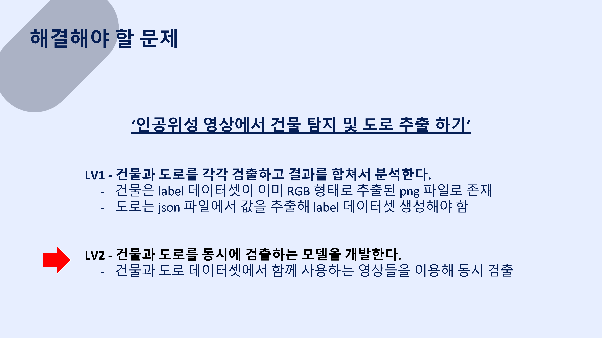

# Building and Road Semantic Segmentation

## Project: SIA x 인공위성 이미지에서 건물과 도로 탐지

## Term

2021년 10월 22일 ~ 2021년 12월 5일

## Summary 

Preprocessing.ipynb : GeoJson에서 도로와 건물 추출 및 데이터 전처리

## Reference

https://quaint-woodwind-b6d.notion.site/2de9b2ee05c442f78e96f4f1ad34e343

## Contact

bsj6551@naver.com
